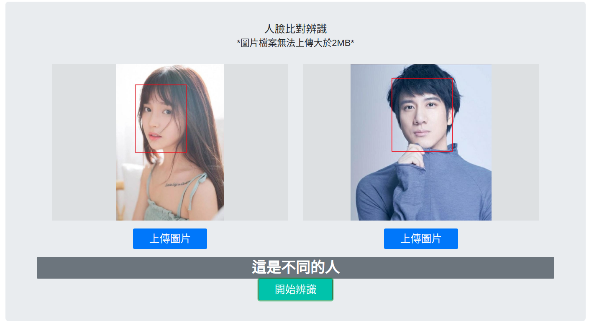
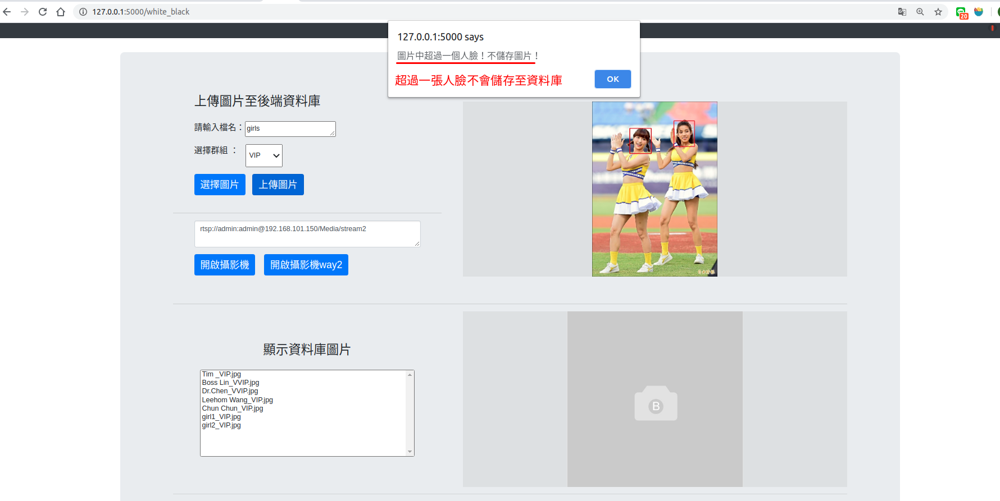

 ## How to use 
 ###first page (host:5000/)

Upload image by clicking button 上傳圖片.

And start recognize by clicking button 上傳圖片.

face location will writen on image.

The answer is same person or not will show under image

If image can't find face will show which image without face.

### white_black page (host:5000/white_black)
This page has three part,

part1: upload image to database

part2: show database images  

part3: upload image to recognize who is it.

* First upload image, only one face in image can be upload (no face,more than one can't not be upload).
   
    
   

* Second, you can check out the image which you upload in database.
   

* Final, upload image to compare whit database who is it 
   
